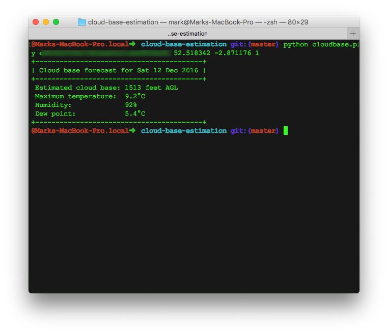

# CloudBase.py

A simple python script for estimating forecast cloud base for a location.

# Instructions for use
1. Clone this repo
1. Install the requirements `pip install -r requirements.txt`
1. Get a DarkSkies API key from (https://darksky.net/dev/)[https://darksky.net/dev/]
1. Run the script with `python cloudbase.py [API Key] [lat] [lng]` e.g.
`python cloudbase.py myapikeymyapikeymyapikey 52.518342 -2.871176`

# Future Cloud Base Forecast
To get cloud base forecasts for future dates, add an optional day argument to the
script. Day indexes are zero-based
e.g. `python cloudbase.py myapikeymyapikeymyapikey 52.518342 -2.871176 1` will return
the cloud base forecast for tomorrow.

##Thanks to
[Christopher Blunck](http://pydoc.net/Python/weather/0.9.1/weather.units.temp/) and (Meteo Blog)[http://www.meteo-blog.net/2012-05/dewpoint-calculation-script-in-python/]
for the temperature conversion and dewpoint estimation functions I've used in this script.
