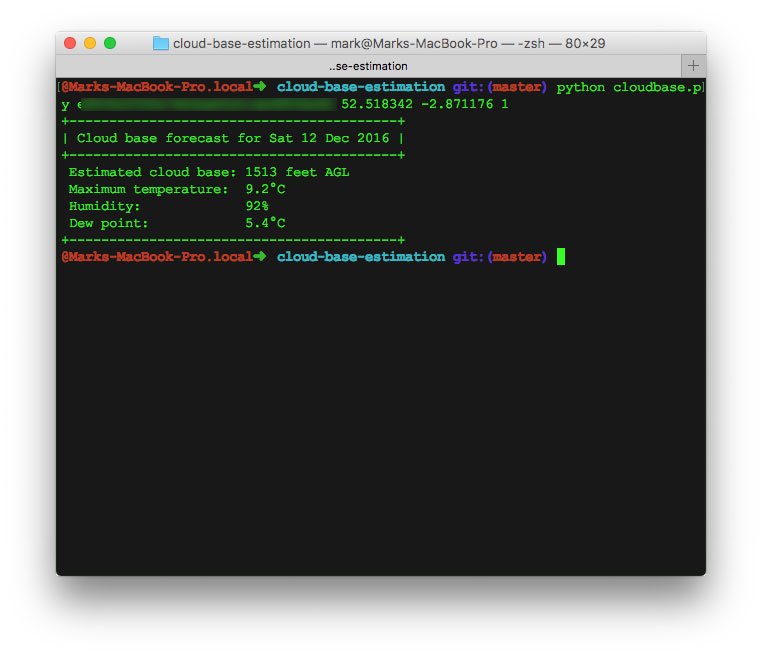
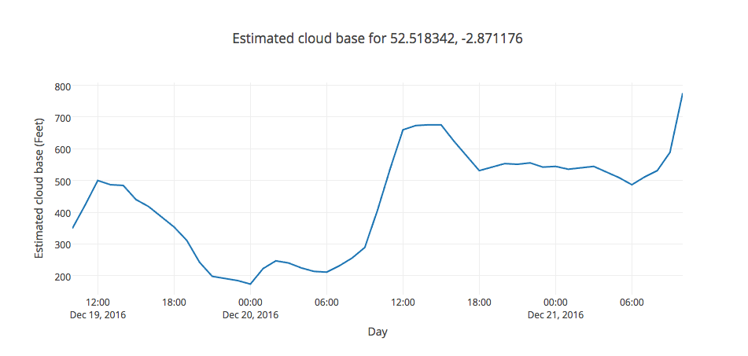

# CloudBase.py

A simple python script for estimating forecast cloud base for a location.

It is possible to get daily and hourly cloud base forecasts as well as plot fancy
charts like this using [plot.ly](http://plot.ly):

## Instructions
1. Clone this repo
1. Install the requirements `pip install -r requirements.txt`
1. Get a DarkSkies API key from [https://darksky.net/dev/](https://darksky.net/dev/)
1. If you want to plot hourly forecasts on a chart, [create a free plot.ly account](https://plot.ly/) and get an API key. You'll use this later.

## Use
### Daily Forecast
Run the script with the following arguments:

 `python cloudbase.py [Dark Sky API Key] [lat] [lng] [day]`

 e.g.
`python cloudbase.py myapikeymyapikeymyapikey 52.518342 -2.871176 0`

### Hourly Forecast
Run the script with the following arguments:

 `python cloudbase.py [Dark Sky API Key] [lat] [lng] hourly`

e.g. `python cloudbase.py myapikeymyapikeymyapikey 52.518342 -2.871176 hourly`

#### Hourly Forecast Chart Plotting
Call the script with the hourly parameters and append your plot.ly username and API key.

e.g. `python cloudbase.py [Dark Sky API Key] [lat] [lng] hourly mark d9asABB0swRRRlxx`

##Thanks
[Christopher Blunck](http://pydoc.net/Python/weather/0.9.1/weather.units.temp/)
for the temperature conversion functions I've used in this script.
